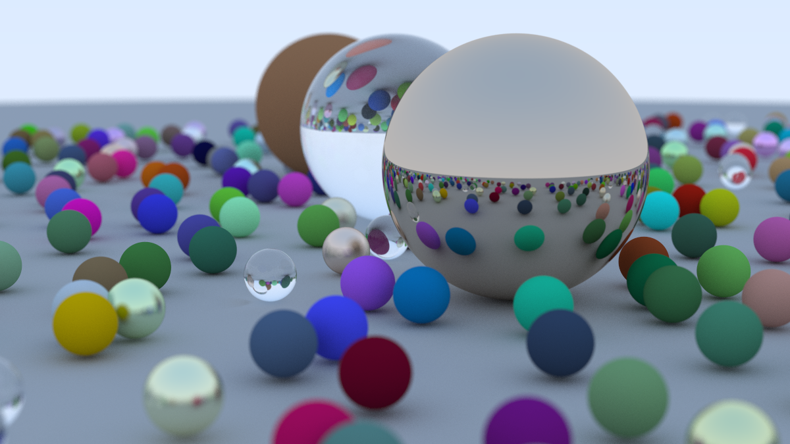

# Multithreaded Ray Tracer

## Ray Tracing in One Weekend

This project is an implementation of Peter Shirley’s  
[*Ray Tracing in One Weekend*](https://raytracing.github.io/books/RayTracingInOneWeekend.html),  
the first book in the Ray Tracing trilogy series, written in C++.

In addition to single threaded implementation, I've added multithreading to keep the render time reasonable.

---

### Final Render (500 Samples Per Pixel, 1200×675)

---

## Performance Benchmark

My CPU is Intel Core i9-13900H with 8E and 6P cores (20 logical threads). The above image was rendered in about 5m 20s with all of the logical threads saturated and CPU utilization at ~95% with a base clock of 2.8GHz. The image consists of 500 samples per pixel, 50 Max recursion depth at 1200 x 675 resolution. The original PPM image was converted to PNG format using ImageMagick.

### Render Time

| Mode              | Render Time |
|-------------------|------------|
| Single-threaded   | 2 hours 59 minutes |
| Multithreaded     | 5 minutes 20 seconds |

